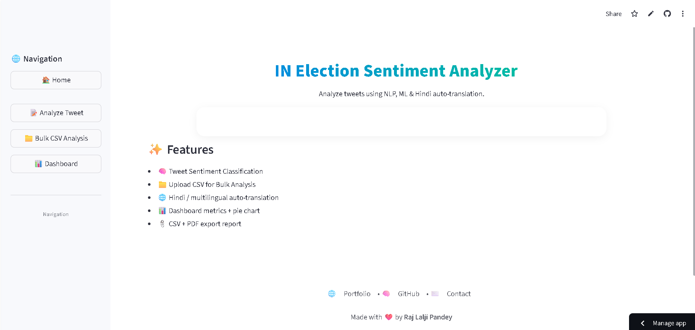
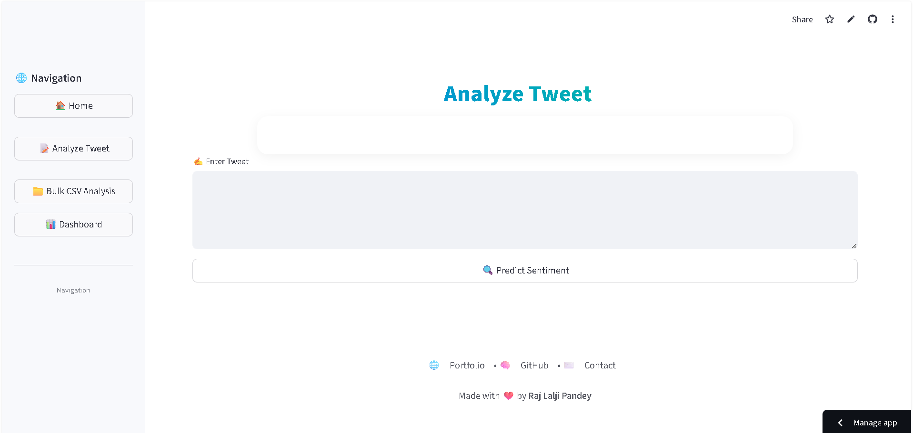
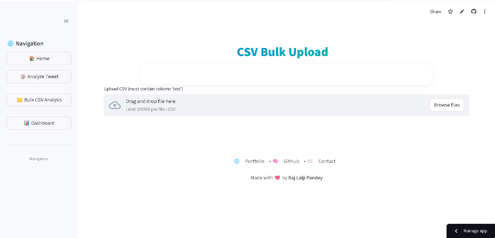
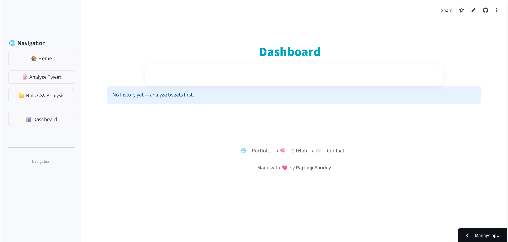

<p align="center">
  
</p>

<h1 align="center">🗳️ IN Election Sentiment Analyzer</h1>
<p align="center">Analyze Indian Election Tweets using NLP, Machine Learning, Hindi Translation & CSV/PDF Analytics 🚀</p>

<p align="center">
  <a href="https://election-sentiment-analysis-nlp-rajlaljipandey.streamlit.app" target="_blank">🌐 Live App</a> •
  <a href="https://github.com/rajlaljipandey/election-sentiment-analysis-nlp" target="_blank">📦 GitHub Repo</a> •
  <a href="https://rajlaljipandey.github.io/" target="_blank">👤 Portfolio</a>
</p>

---

## 🧠 About the Project
The **IN Election Sentiment Analyzer** is a Streamlit-based ML application that enables:
- Sentiment prediction (Positive / Negative)
- Hindi & multilingual text auto-translation
- CSV Bulk tweet analysis
- Pie-chart sentiment dashboard
- CSV + PDF export 🧾

This project is useful for **journalists, political analysts, researchers, students** and anyone practicing NLP sentiment classification.

---

## ✨ Features

| Feature | Description |
|--------|-------------|
| 🧠 ML-Based Sentiment Classification | Predict sentiment using Logistic Regression model |
| 📁 Bulk CSV Import & Export | Upload dataset → Analyze → Download output |
| 🌐 Hindi → English Auto Translation | Uses Deep Translator |
| 📊 Dashboard Visualization | Pie chart + Summary analytics |
| 📄 Export Tools | Save results as CSV or PDF |
| 🎨 UI Optimized | Desktop + mobile responsive |

---

## 🖼️ UI Preview

| Screen | Preview |
|--------|---------|
| 🏠 Home |  |
| 📝 Analyze Tweet |  |
| 📁 CSV Upload |  |
| 📊 Dashboard |  |

---

## 🏗️ Tech Stack

| Category | Tools |
|---------|-------|
| Frontend UI | Streamlit |
| ML | Scikit-Learn, Logistic Regression, TF-IDF |
| NLP Utility | Deep Translator, Regex |
| Visualization | Matplotlib |
| Export | reportlab (PDF), pandas |
| Hosting | Streamlit Cloud |

---

## 🚀 Run Locally

### 1️⃣ Clone Repo
```bash
git clone https://github.com/rajlaljipandey/election-sentiment-analysis-nlp.git
cd election-sentiment-analysis-nlp
2️⃣ Install Requirements
bash
Copy code
pip install -r requirements.txt
3️⃣ Launch App
bash
Copy code
streamlit run app.py
🧪 Example Sentiment Outputs
bash
Copy code
Input: "Modi ji is doing great work"
→ 😊 Positive (92.3%)

Input: "सरकार कुछ नहीं कर रही"
→ Translated → "Government is doing nothing"
→ 😡 Negative (87.9%)
⚙️ How It Works (Pipeline)
mathematica
Copy code
Tweet → Language Detection → Auto Translation
     → TF-IDF Vectorizer → ML Model (LogReg)
     → Output Sentiment (Positive / Negative)
     → Dashboard UI → Export CSV / PDF
📤 Export Options
Format	Usage
📄 PDF	Full sentiment report
📑 CSV	Tweet-wise prediction export

👨‍💻 Developer
👤 Raj Lalji Pandey
🌐 Portfolio — https://rajlaljipandey.github.io/
🧠 GitHub — https://github.com/rajlaljipandey
✉️ Email — rajlaljipandey@gmail.com

📜 License
Licensed under MIT License – Free to use, modify & distribute.

⭐ Support
If this helped you, please star ⭐ the repository to support its growth!
